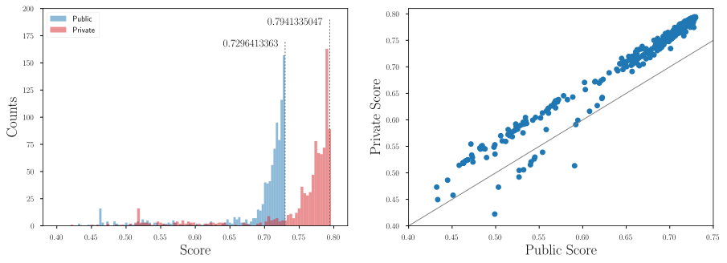

McKinsey Analytics Online Hackaton (20 - 22.07.2018)
==================================


# Problem Statement
Your client is an Insurance company and they need your help in building a model to predict the propensity to pay renewal premium and build an incentive plan for its agents to maximise the net revenue (i.e. renewals - incentives given to collect the renewals) collected from the policies post their issuance.
 
You have information about past transactions from the policy holders along with their demographics. The client has provided aggregated historical transactional data like number of premiums delayed by 3/6/12 months across all the products, number of premiums paid, customer sourcing channel and customer demographics like age, monthly income and area type.
 
In addition to the information above, the client has provided the following relationships:
1. Expected effort in hours put in by an agent for incentives provided.
2. Expected increase in chances of renewal, given the effort from the agent.
 
Given the information, the client wants you to predict the propensity of renewal collection and create an incentive plan for agents (at policy level) to maximise the net revenues from these policies.

# Evaluation Criteria

Your solutions will be evaluated on 2 criteria:
* A. The base probability of receiving a premium on a policy without considering any incentive.
* B. The monthly incentives you will provide on each policy to maximize the net revenue.
 
Part A:
The probabilities predicted by the participants would be evaluated using AUC ROC score.
 
Part B:
The net revenue across all policies will be calculated by summing and across all policies using the following manner:

`Net Revenue on policy = (p + dp) * premium on policy - Incentive on policy`

where 
* `p` - is the renewal probability predicted using a benchmark model by the insurance company.
* `dp` - (% Improvement in renewal probability*`p`) is the improvement in renewal probability calculated from the agent efforts in hours.
* `Premium on policy` is the premium paid by the policy holder for the policy in consideration.
* `Incentive on policy` is the incentive given to the agent for increasing the chance of renewal (estimated by the participant) for each policy.

The following curve provide the relationship between extra effort in hours invested by the agent with Incentive to the agent and % improvement in renewal probability vs agent effort in hours.
 
1. Relationship b/w Extra efforts in hours invested by an agent and Incentive to agent. After a point more incentives does not convert to extra efforts.

```
Y = 10*(1 - exp(-x/400))
```

2. Relationship between % improvement in renewal probability vs Agent effort in hours. The renewal probability cannot be improved beyond a certain level even with more efforts.

```
Y = 20*(1 - exp(-x/5))
```

Overall Ranking at the leaderboard would be done using the following equation:
 
`Combined Score = w1*AUC-ROC value + w2*(net revenue collected from all policies)*lambda`
 
where `w1 = 0.7`, `w2 = 0.3` and `lambda` is a normalizing factor.

Public leaderboard is based on 40% of the policies, while private leaderboard will be evaluated on remaining 60% of policies in the test dataset.

# Data

| Variable 	| Definition |
| :-----------:	| :--------: |
| `id` 		| Unique ID of the policy |
| `perc_premium_paid_by_cash_credit` | Percentage of premium amount paid by cash or credit card |
| `age_in_days` | Age in days of policy holder |
| `Income` | Monthly Income of policy holder |
| `Count_3-6_months_late` | No of premiums late by 3 to 6 months |
| `Count_6-12_months_late` | No  of premiums late by 6 to 12 months |
| `Count_more_than_12_months_late` | No of premiums late by more than 12 months |
| `application_underwriting_score` | Underwriting Score of the applicant at the time of application (No applications under the score of 90 are insured) |
| `no_of_premiums_paid` | Total premiums paid on time till now |
| `sourcing_channel` | Sourcing channel for application |
| `residence_area_type` | Area type of Residence (Urban/Rural) |
| `premium` | Monthly premium amount |
| `renewal` | Policy Renewed? (0 - not renewed, 1 - renewed) |

Training data (train.csv) and test data (test.csv) are stored in `data` directory.


# My Solution


Stacking (10 out-of-fold) using optimized XGBoost, Random Forest and Neural Network Classifiers. The 3 models were performing the best in terms of AUC and LogLoss.
Output probabilities were used as an input to the Logistic Regression classifier with and without extra feature. 

Public score:
* 0.729573704224991 (with extra feature)
* 0.729171265797949 (without extra feature)

### Missing values
There was no strategy in case of XGBoost. For other models I imputed missing values using mean of the columns. 

### Other
In case of Neural Network `Income` was transformed using `log(x)` function and `age_in_days` using Box-Cox transform (optimal). I also used `StandardScaler` for all features.

### Flow
```shell
python ./Stacking/stacked_estimate.py
python ./Stacking/meta_classifier.py predict
python optimize_revenue.py
```

# Summary
5000+ people registered. 900+ participants in the competition. Score distribution on the public and private leaderboard is presenetd below. 



# Results
* 2nd on the public leaderboard.
* 4th on the private leaderboard.
